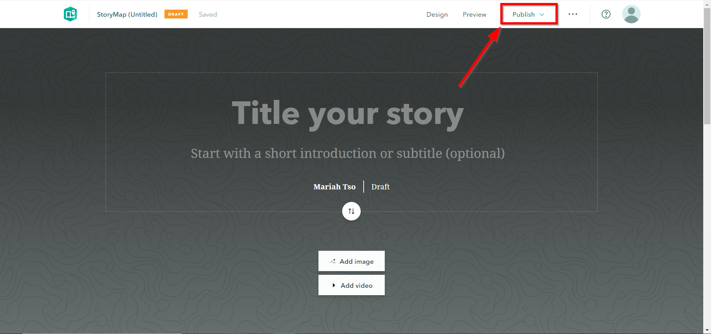
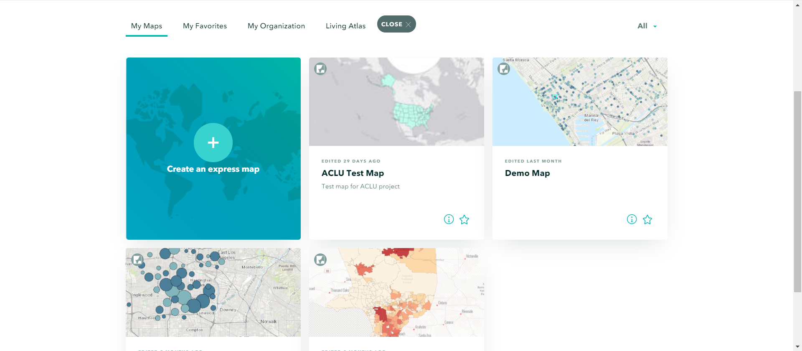
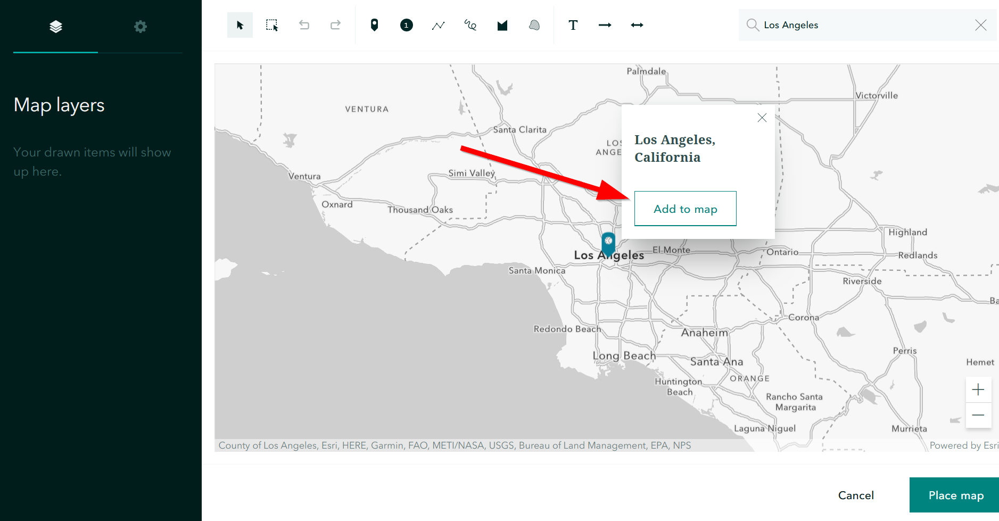
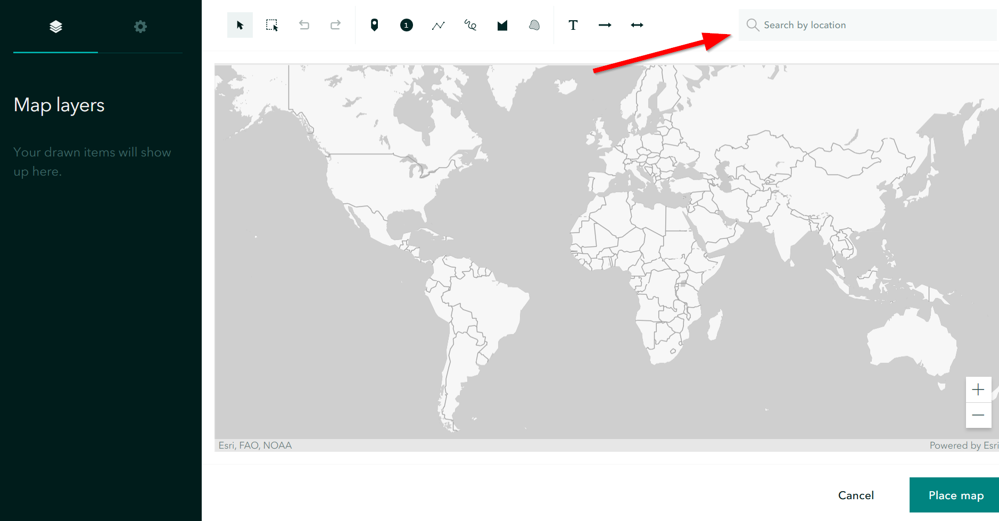
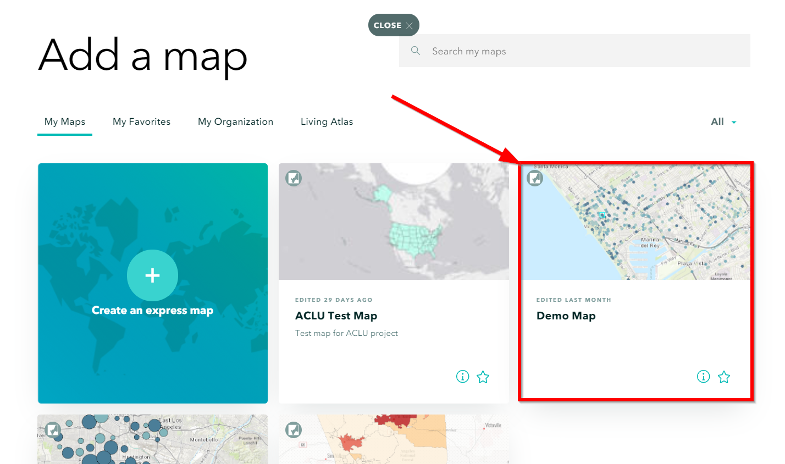
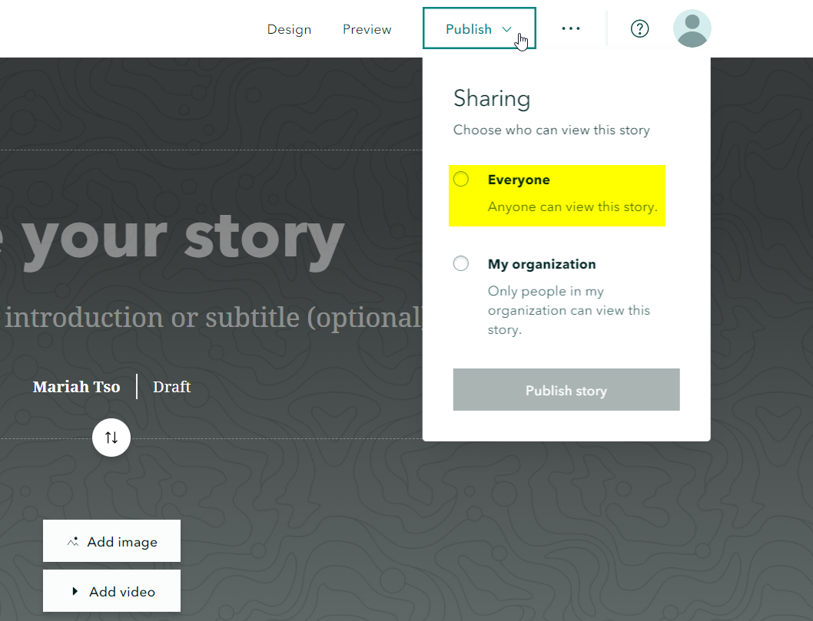

Quick Visual Guide to Visualizing Data in ArcGIS Online
=======================================================

By\ `Mariah Tso <https://www.linkedin.com/in/mariah-tso-983340121>`__\ and\ `Albert Kochaphum <https://www.linkedin.com/in/albertkun/>`__\ (albertkun@idre.ucla.edu) 
^^^^^^^^^^^^^^^^^^^^^^^^^^^^^^^^^^^^^^^^^^^^^^^^^^^^^^^^^^^^^^^^^^^^^^^^^^^^^^^^^^^^^^^^^^^^^^^^^^^^^^^^^^^^^^^^^^^^^^^^^^^^^^^^^^^^^^^^^^^^^^^^^^^^^^^^^^^^^^^^^^^^^

Link to this guide:\ https://tinyurl.com/y62oajsc

Introduction to GIS Vector Data
-------------------------------

There are three basic types of vector data: points, lines, and polygons.
See the figure below for an example of each of the types.

|image0|

Getting Started
---------------

Note: This tutorial uses arrest data downloaded from Los Angeles Open
Data portal filtered for the year of 2017 only (see: `Quick Visual Guide
to Visualizing Data on LA Open Data
Portal <https://drive.google.com/file/d/140rq7sU548VdtYMkiQ8SLIMDLl7smoJE/view?usp=sharing>`__\ )

You can download the data here:

https://sandbox.idre.ucla.edu/data/Arrest_Data_from_January_2017.csv

1. Create your ArcGIS Online Public Account
      (\ https://www.arcgis.com/home/createaccount.html\ )

..

   |image1|

   |image2|

2. Once your account has been successfully created, click on ‘Map’ to
      start your first map!

..

   |image3|

Working with Point Data
-----------------------

There are multiple ways to add data in ArcGIS Online. Let’s start with
adding data in Map View.

Adding Point Data (Less than 2,000 records*) in Map View
~~~~~~~~~~~~~~~~~~~~~~~~~~~~~~~~~~~~~~~~~~~~~~~~~~~~~~~~

1. Click on the ‘Add Content to Map’ icon in Map View. The first two
      options from the drop down menu allow you to search for already
      shared data on ArcGIS Online or the Living Atlas. While the last
      three options allow you to add your own data. Click on ‘Add Layer
      from File”.

|image4|

2. Find your CSV file with the arrest data from the LA County Data
      Portal. Make sure you have the location data cleaned up!

3. (add screenshot for adding CSV haha)

   a. Note: If you data has not been cleaned up yet see:\ `Quick Visual
         Guide for Cleaning Data in Microsoft
         Excel <https://docs.google.com/document/d/13GJ6NBgIHUQkQzAbFcefO7qHfbxom1BxQMFXom3WJ60/>`__

   b. Note: The maximum number of records for adding data via this
         method 2,000. If you attempt to use your arrest data from the
         LA City Portal then ArcGIS Online will return the following
         error message:

..

   |image5|

4. A workaround for this size limitation is publishing your csv file on
      Github and linking the data back to your map.

   c. Note: If you pay for an ArcGIS Online account you can also publish
         a feature service from one of the two desktop software options:
         ArcMap or ArcGIS Pro. These options have higher maximum records
         for publishing, however the Github option is a good free
         workaround.

Big Data Workaround: Github to the Rescue
~~~~~~~~~~~~~~~~~~~~~~~~~~~~~~~~~~~~~~~~~

Free accounts are limited to less than 2,000 records, so we need to find
a work around for this. One method is to store your data somewhere
online, this is where the coding repository, GitHub comes in handy!

Creating a Github Account
^^^^^^^^^^^^^^^^^^^^^^^^^

1. Github is a platform for developers and a place to store, share, and
      collaborate on coding projects. Create a Github Account
      here:\ https://github.com/join

..

   |image6|

2. Go ahead and set up a free account

..

   |image7|

3. After you click your email activation link, you can create your first
      repository, give it a name and make sure it is a Public
      repository:

..

   |image8|

   |image9|

4. After creating your repository, click on “uploading an existing
      file”\ |image10|

5. Drag the csv file with the locations into the upload location or
      click “choose your files” if you want to locate it (reminder: make
      sure latitude and longitude are separate columns!)

..

   |image11|

6. Add a “commit” title and then commit your changes:

..

   |image12|

7. Click the csv file:

..

   |image13|

8. Click on “View Raw”

..

   |image14|

9. Copy the URL

..

   |image15|

10. Now, finally go back to ArcGIS Online and click on “Add data from
       web”

..

   |image16|

11. Choose “A CSV file”:

..

   |image17|

12. Paste the URL in to “URL”:

..

   |image18|

13. Click “Add Layer”

..

   |image19|

14. Now we can start to style it!

Geocoding your data
~~~~~~~~~~~~~~~~~~~

Sometimes you will not have latitude and longitude, what to do then?

We can geocode it!

This tool below takes in copy-pasted CSV files with a “Address” column
name, that can be a city, country, or street address:

https://gis.ucla.edu/geocoder

1. Open up your CSV file in a text editor:

..

   |image20|

2. For the UCLA Geocoder, make sure your location column has “ADDRESS”
      for the field name!!

..

   |image21|

3. Select all the data and copy it

..

   |image22|

4. Go to\ https://gis.ucla.edu/geocoder

5. Scroll down to the input box

..

   |image23|

6. Paste your data into it and click “Geocode Addresses”

..

   |image24|

7. Copy the output to your clipboard

..

   |image25|

Let’s take that data into GitHub so we can map it!

8. Open up GitHub and click on your data repository

..

   |image26|

9. Click on “create new file”

..

   |image27|

10. Paste your CSV data into there.

..

   |image28|

11. Commit the changes!

..

   |image29|

12. Open the raw CSV file and copy the URL.

13. Paste the URL into ArcGIS Online “Add Data from Web”

Styling Point Data
~~~~~~~~~~~~~~~~~~

1. There are a variety of ways to style your point data. The best
      symbology for your data depends on what kind of story you wish to
      tell. Try each of the different methods listed below to see which
      fits best for your data.

..

   When you add your data, the style pane should automatically appear,
   however to access the symbology settings for your layer at any time,
   go to the ‘Details’ pane and click on ‘Contents’. The Contents pane
   displays each layer within your map. Click on the ‘Change Style’ icon
   to open the symbology settings for your arrest data layer.

   |image30|

2. The Change Style pane consists of a two step process. The first step
      dictates which attribute to display and the second step controls
      the drawing style.

Location Only Symbology
^^^^^^^^^^^^^^^^^^^^^^^

1. For now, let’s stick with the default options:

   a. Show Location Only

   b. Location (Single symbol)

..

   Click on ‘Options’ under Location (Single symbol).

   |image31|

3. There are three main elements under the Styling options for Showing
      Location Only:

   c. Symbol: Controls all of the styling options for the chosen point
         symbol.

   d. Transparency: Controls the transparency of each point.

   e. Visible Range: Drag the two tick marks to control the scale ranges
         that the selected layer becomes visible.

..

   |image32|

4. Click on ‘Symbols’. A new window pops up with more styling options.
      Click on the ‘Shapes’ drop-down menu and select ‘Basic’.

..

   |image33|\ |image34|

5. Make the following changes to your symbol:

   f. Chose Basic Circle

   g. Size: 5 px

   h. Fill: Light Blue

   i. Outline: Dark Blue

   j. Overall Transparency: 25%

   k. Visibility Range: Counties to Buildings

..

   Click ‘Ok’.

   |image35|

6. With so many points, it is difficult to see any spatial patterns
      within your dataset when symbolizing individual points. Try a
      different symbology method and switch from ‘Show location only’ to
      ‘Heat Map’.

7. Heat maps represent density and show the range of areas where arrests
      have low and high density. Notice the difference in your map from
      the previous symbology and how downtown Los Angeles emerges as a
      dense area for arrests.

|image36|

Attribute Based Symbology
^^^^^^^^^^^^^^^^^^^^^^^^^

8. Click ‘Ok’ to return to the original Change Style pane. Now under
      Step 1, select ‘Age’ for ‘Choose an attribute to show’.

   Scroll down to see the six options for drawing styles by attributes:

1. Counts and Amounts (Size)

2. Counts and Amounts (Color)

3. Heat Map

4. Location (Single Symbol)

5. Types (Unique Symbols)

..

   |image37|

9. Select ‘Counts and Amounts(Color)’ and Click ‘Options’. Then Click
      ‘Classify Data’.

   Data classification refers to how you group your data into classes to
   better visualize patterns across your dataset. There are a variety of
   methods for data classification. To learn more about the different
   methods see Esri’s\ `Data Classification Help
   Page <https://desktop.arcgis.com/en/arcmap/latest/extensions/geostatistical-analyst/data-classification.htm>`__\ .

|image38| |image39|

10. Select ‘Natural Breaks’ from the dropdown menu and keep the number
       of classes at 4. Then select ‘10’ from the ‘Round classes’
       dropdown menu. Notice how the breaks change and how the
       classification type changes to ‘Manual Breaks’.

|image40| |image41|

11. Click ‘Ok’. Then click ‘Done’. Then save your map.

Enable Clustering
^^^^^^^^^^^^^^^^^

1. An additional cartographic feature that’s helpful for viewing dense
      point data is the clustering feature. To enable this feature
      browse to your layer in the ‘Contents’ pane and select the
      ‘Cluster Points’ icon.

..

   |image42|

2. Slide the clustering bar to create more or less clusters.

..

   |image43|

3. Zoom in and out to see how the clusters adjust as you change scales.
      Click on a cluster to get a summary.

..

   |image44|

Working with Polygon Data
-------------------------

Getting Polygon Data
~~~~~~~~~~~~~~~~~~~~

Shapefiles are ESRI files that can be found on the web, typically as a
compressed zip file.

Let’s go to the LA Times website and grab a shapefile of Los Angeles
Neighborhoods:

http://boundaries.latimes.com/sets/

|image45|

Adding Polygon Data in Map View
~~~~~~~~~~~~~~~~~~~~~~~~~~~~~~~

1. Click ‘Add Content to Map’ and select ‘Add Data from File’

..

   |image46|

2. Select “Browse”

..

   |image47|

3. Choose the zipped shapefile

..

   |image48|

4. Click on “Import Layer” to finish adding the file:

..

   |image49|

5. Now we can start to style it!

Styling Polygon Data/Choropleth Map
~~~~~~~~~~~~~~~~~~~~~~~~~~~~~~~~~~~

1. Just like the point data, the Change Style pane for polygon data
      (would also be the same for line data) consists of a two step
      process. The first step dictates which attribute to display and
      the second step controls the drawing style. Select ‘type’ for your
      attribute and select ‘Types (unique symbols)’ for drawing style.

|image50|

2. Keep the default colors and Click ‘Done’. Select and drag the
      neighborhoods layer to move it below the arrest layer.

..

   |image51|

3. Notice what the arrest data looks like on top of the neighborhood
      layer. Is your map readable? What needs to be changed to increase
      the legibility of your map?

Other Map Tools
---------------

Table of Contents: Managing your Data
~~~~~~~~~~~~~~~~~~~~~~~~~~~~~~~~~~~~~

1. To access the Table of Contents and general map information, click on
      the ‘Details’ section (This should be the default view for your
      map).

..

   This section consists of three subsections: About this Map, Show
   Contents of Map, and Show Map Legend. The About icon displays a quick
   breakdown of how to build your map. We will return to the next two
   subsections after we add data to the map. |image52|

2. Click ‘Save’. Enter the mandatory Map Title information, Tags, and
      Description to save your map.

Bookmarks
~~~~~~~~~

1. Bookmarks are a great tool for saving views. Type ‘Venice, CA’ in the
      search box. Once zoomed to Venice, click ‘Bookmarks’ and select
      ‘Add Bookmark’ and name bookmark as ‘Venice’.

|image53|

2. Test your bookmark by zooming out to another section of the map.
      Click ‘Bookmarks’ and select your newly created ‘Venice’ bookmark
      to return to Venice on map.

..

   |image54|

Changing the Basemap
~~~~~~~~~~~~~~~~~~~~

1. Click on ‘Basemap Gallery’, browse options and explore the basemap
      options.

   a. Note: Basemaps are an important cartographic choice for building
         your map. If you have a lot of information on your map a
         minimal basemap may be the best choice.

..

   |image55|

   |image56|

2. Select the ‘Dark Gray Canvas’ and add to your map. |image57|

Adding Other Layers
~~~~~~~~~~~~~~~~~~~

You can also add publicly shared layers.

1. Click on “Search for Layers”

|image58|

2. Click on “ArcGIS Online”

..

   |image59|

3. Type in “Historic Los Angeles”

..

   |image60|

4. Pay close attention to the author and source of the map to make sure
      it is legitimate. David Rumsey is a map librarian who hosts a lot
      of maps on his website, so this is pretty good!

..

   |image61|

5. Click on “Add to Map” to finish adding your new map (you can add it
      as a basemap if you want the map to sit behind all your other data
      points).

..

   |image62|

6. Now you can use the historical map to provide more context about your
      data.

..

   |image63|

Renaming & Copying Layers
~~~~~~~~~~~~~~~~~~~~~~~~~

1. To rename layers toggle ‘More Options’ on a layer and select
      ‘Rename’. Clean up your neighborhoods layer by renaming to “LA
      County Neighborhoods”.

..

   |image64|

2. Sometimes you may want to include different symbologies for the same
      layer. Toggle ‘More Options’ on the arrest data layer and select
      ‘Copy’. Rename the new layer ‘Arrest Data Heat Map’. Configure the
      symbology on this new copy as a heat map.

Configuring Pop-Ups
~~~~~~~~~~~~~~~~~~~

1. Disable Clustering on your arrest data layer. Click ‘Ok’.

..

   |image65| |image66|

2. Click on the ellipses icon for More Options for your arrest data
      layer and select ‘Configure Pop-Ups’.

..

   |image67|

3. Click on a random point in your map to view a pop-up. Notice the (1
      of #) notification in the top left corner. This signifies that
      there are multiple points at the same location. Click on the arrow
      button to see the pop-up for each point. Remember to use the
      scroll bar to see all the available information.

|image68|

4. Revise the Pop-up Title to read “Arrest Record: {Record_ID}”. Use the
      ‘Add field name or expression’ icon to select {Report_ID} field.
      The curly brackets denote a field name, and inclusion in the title
      means the pop-up will populate with each individual records Report
      ID. Then Click the ‘Configure Attributes’ Button.

..

   |image69|

   |image70|

5. In the Configure Attributes window you can control which attributes
      are displayed in your pop-up. Make the following changes to your
      pop-up.

   a. Unclick the ‘Use 1000 Separator’ format fox for Report ID and
         Reporting District

   b. Uncheck the following fields from display: Time, Address, Cross
         Street, and any location coordinate fields.

   c. Reorder Arrest Type Code to appear after Descent Code (Select
         field and use the arrows on the right to reorder). Click ‘Ok’.
         Then Click ‘Ok’ again.

|image71|

6. Click on a random point again to see how your pop-up has changed.

|image72|

Adding images to a pop-up
^^^^^^^^^^^^^^^^^^^^^^^^^

1. You can add images to a pop-up by scrolling down to “Pop-up Media”
      and clicking “Add”

..

   |image73|

2. Select “Image”

..

   |image74|

3. You can choose the field which contains the URL for all the images:

..

   |image75|

4. Now whenever someone clicks on the pop-up your image will also
      appear!

Sharing & Publishing Your Map
-----------------------------

Saving your map
~~~~~~~~~~~~~~~

With your map stylized and ready to go, the time has come to save and
share it!

1. Click on the “Save” icon

2. |image76|

3. Give your map a name and tag and then click “Save Map”\ |image77|

4. To share our saved map, click on the “Share” icon:

..

   |image78|

5. Click on “Everyone” to share the map with the public and allow your
      map to be embedded onto a webpage.

..

   |image79|

6. You can either link to the map or embed it:

..

   |image80|

7. Embed in website allows you to customize the map further (1), but be
      sure to copy and paste the embed code (2) into your website when
      you are done!

..

   |image81|

8. Congratulations! You have successfully saved and shared your map!

..

Optional: Organizing your Finished Maps & Content
~~~~~~~~~~~~~~~~~~~~~~~~~~~~~~~~~~~~~~~~~~~~~~~~~

If you are creating a lot of maps and content, you may want to start
organizing it using metadata.

1. Toggle ‘More Options’ for one of your layers

..

   |image82|

2. A new browser window will open with detailed information for your
      layer. Review the various components of this page, particularly
      the title, summary, descriptions, and terms of use. It is
      important to fill out and organize this section if you are working
      with multiple maps and layers in order to stay organized.

..

   |image83|

3. Update the summary and description to read “Data downloaded from LA
      City Data Portal (include hyperlink to original source) on [insert
      date] filtered for the month of December, 2016.” Update the Terms
      of Use to include the original source and state “Data downloaded
      for educational and training purposes. To use data see original
      source:\ `Arrest Data from 2010 to
      Present <https://data.lacity.org/A-Safe-City/Arrest-Data-from-2010-to-Present/yru6-6re4>`__\ .
      Data Provider: Los Angeles Police Department. Data Owner: LAPD
      OpenData”

..

   |image84|

.. |image0| image:: media/image46.png
   :width: 5.50521in
   :height: 2.81436in

.. |image2| image:: media/image38.png
   :width: 6.5in
   :height: 3.73611in
.. |image3| image:: media/image6.png
   :width: 6.5in
   :height: 3.73611in
.. |image4| image:: media/image34.png
   :width: 6.5in
   :height: 2.84722in
.. |image5| image:: media/image58.png
   :width: 4.95833in
   :height: 2.94792in
.. |image6| image:: media/image52.png
   :width: 6.5in
   :height: 3.45833in
.. |image7| image:: media/image60.png
   :width: 6.5in
   :height: 3.45833in
.. |image8| image:: media/image22.png
   :width: 6.5in
   :height: 3.41667in
.. |image9| image:: media/image2.png
   :width: 6.5in
   :height: 3.41667in
.. |image10| image:: media/image28.png
   :width: 6.5in
   :height: 3.41667in
.. |image11| image:: media/image51.png
   :width: 6.5in
   :height: 3.41667in
.. |image12| image:: media/image57.png
   :width: 6.5in
   :height: 3.41667in
.. |image13| image:: media/image5.png
   :width: 6.5in
   :height: 3.41667in
.. |image14| image:: media/image39.png
   :width: 6.5in
   :height: 3.41667in
.. |image15| image:: media/image9.png
   :width: 6.5in
   :height: 4.19444in
.. |image16| image:: media/image66.png
   :width: 6.5in
   :height: 3.375in
.. |image17| image:: media/image49.png
   :width: 6.5in
   :height: 3.375in
.. |image18| image:: media/image27.png
   :width: 6.5in
   :height: 3.375in
.. |image19| image:: media/image37.png
   :width: 6.5in
   :height: 3.375in
.. |image20| image:: media/image35.png
   :width: 5.29688in
   :height: 2.9853in
.. |image21| image:: media/image26.png
   :width: 3.04442in
   :height: 1.68229in
.. |image22| image:: media/image20.png
   :width: 3.07109in
   :height: 2.25521in

.. |image24| image:: media/image33.png
   :width: 6.5in
   :height: 4.27778in
.. |image25| image:: media/image73.png
   :width: 6.5in
   :height: 3.27778in
.. |image26| image:: media/image55.png
   :width: 6.5in
   :height: 2.83333in

.. |image28| image:: media/image74.png
   :width: 6.5in
   :height: 2.76389in
.. |image29| image:: media/image36.png
   :width: 6.5in
   :height: 2.76389in
.. |image30| image:: media/image82.png
   :width: 6.23958in
   :height: 4.33333in
.. |image31| image:: media/image48.png
   :width: 2.49479in
   :height: 4.25074in
.. |image32| image:: media/image41.png
   :width: 2.40437in
   :height: 4.08854in
.. |image33| image:: media/image67.png
   :width: 2.84896in
   :height: 4.08764in
.. |image34| image:: media/image69.png
   :width: 2.78646in
   :height: 3.594in
.. |image35| image:: media/image81.png
   :width: 6.22396in
   :height: 4.33164in
.. |image36| image:: media/image78.png
   :width: 6.09896in
   :height: 4.23458in
.. |image37| image:: media/image54.png
   :width: 2.60921in
   :height: 4.45313in
.. |image38| image:: media/image13.png
   :width: 2.70785in
   :height: 4.63021in
.. |image39| image:: media/image15.png
   :width: 2.72612in
   :height: 4.66146in
.. |image40| image:: media/image40.png
   :width: 2.71354in
   :height: 4.63119in
.. |image41| image:: media/image68.png
   :width: 2.69271in
   :height: 4.59449in
.. |image42| image:: media/image85.png
   :width: 5.96354in
   :height: 4.1504in
.. |image43| image:: media/image79.png
   :width: 6.00521in
   :height: 4.1794in
.. |image44| image:: media/image77.png
   :width: 6.5in
   :height: 3.375in
.. |image45| image:: media/image63.png
   :width: 6.5in
   :height: 3.375in
.. |image46| image:: media/image30.png
   :width: 6.5in
   :height: 3.375in
.. |image47| image:: media/image18.png
   :width: 6.5in
   :height: 3.375in
.. |image48| image:: media/image64.png
   :width: 6.5in
   :height: 4.86458in
.. |image49| image:: media/image61.png
   :width: 6.5in
   :height: 3.375in
.. |image50| image:: media/image84.png
   :width: 6.81771in
   :height: 4.72791in

.. |image52| image:: media/image45.png
   :width: 6.5in
   :height: 2.84722in
.. |image53| image:: media/image7.png
   :width: 6.5in
   :height: 2.84722in
.. |image54| image:: media/image83.png
   :width: 6.5in
   :height: 3.05556in
.. |image55| image:: media/image19.png
   :width: 6.5in
   :height: 2.84722in
.. |image56| image:: media/image4.png
   :width: 6.5in
   :height: 2.84722in
.. |image57| image:: media/image65.png
   :width: 6.5in
   :height: 2.81944in
.. |image58| image:: media/image43.png
   :width: 6.5in
   :height: 3.31944in
.. |image59| image:: media/image42.png
   :width: 6.5in
   :height: 3.31944in
.. |image60| image:: media/image29.png
   :width: 6.5in
   :height: 3.31944in
.. |image61| image:: media/image24.png
   :width: 6.5in
   :height: 3.31944in
.. |image62| image:: media/image12.png
   :width: 6.5in
   :height: 3.94444in

.. |image64| image:: media/image56.png
   :width: 2.4654in
   :height: 3.72396in
.. |image65| image:: media/image62.png
   :width: 2.06771in
   :height: 3.5151in
.. |image66| image:: media/image59.png
   :width: 2.04688in
   :height: 3.47263in
.. |image67| image:: media/image80.png
   :width: 5.96354in
   :height: 4.14056in
.. |image68| image:: media/image71.png
   :width: 3.84896in
   :height: 3.59752in
.. |image69| image:: media/image32.png
   :width: 2.67188in
   :height: 4.54515in
.. |image70| image:: media/image70.png
   :width: 4.93603in
   :height: 2.97396in
.. |image71| image:: media/image14.png
   :width: 6.5in
   :height: 4.30556in
.. |image72| image:: media/image72.png
   :width: 3.95313in
   :height: 3.1162in
.. |image73| image:: media/image25.png
   :width: 6.5in
   :height: 3.94444in
.. |image74| image:: media/image21.png
   :width: 6.5in
   :height: 3.94444in

.. |image76| image:: media/image31.png
   :width: 6.5in
   :height: 3.375in
.. |image77| image:: media/image47.png
   :width: 6.5in
   :height: 3.375in
.. |image78| image:: media/image1.png
   :width: 6.5in
   :height: 3.375in
.. |image79| image:: media/image23.png
   :width: 6.5in
   :height: 3.375in
.. |image80| image:: media/image44.png
   :width: 6.5in
   :height: 3.375in
.. |image81| image:: media/image50.png
   :width: 6.5in
   :height: 3.375in
.. |image82| image:: media/image53.png
   :width: 2.52604in
   :height: 3.69782in
.. |image83| image:: media/image75.png
   :width: 6.5in
   :height: 3.05556in
.. |image84| image:: media/image76.png
   :width: 6.5in
   :height: 3.05556in
