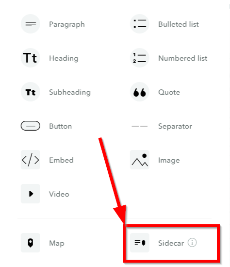

Getting Started
---------------

1. Navigate to the LA Open Data Portal (\ https://data.lacity.org/\ )

2. |image0|

3. Click the magnifying glass:
      \ |C:\Users\akocha\AppData\Local\Microsoft\Windows\INetCache\Content.Word\2019-06-24
      11_52_11-DataLA\_ Information, Insights, and Analysis from the
      City of Angels \_ Los Angele.png|

4. Find the “arrest data set” by typing “arrest” in the search tool
      \ |C:\Users\akocha\AppData\Local\Microsoft\Windows\INetCache\Content.Word\2019-06-24
      11_52_29-DataLA\_ Information, Insights, and Analysis from the
      City of Angels \_ Los Angele.png|

5. In the results page, click on “Arrest Data from 2010 to Present”
      \ |image3|

Viewing Data
------------

6. In the Data set page, you can view information about the data, such
      as column names, source of the data, etc.

7. After familiarizing yourself with the data set, click on “View Data”
      \ |image4|\ 

8. You can scroll through the data columns or records\ |image5|

Filtering the data set by date
------------------------------

9.  Under “Filter” click the initial filter column

10. Choose “Arrest Date” as the column to filter by\ |image6|

11. Next click on “is” and change the filter condition to “is
       after”\ |image7|

12. Choose after “2016”
       \ |C:\Users\akocha\AppData\Local\Microsoft\Windows\INetCache\Content.Word\2019-06-24
       12_03_31-Arrest Data from 2010 to Present \_ Los Angeles - Open
       Data Portal.png|

Visualizing the data
--------------------

13. Click on “Visualize”

14. Choose whether to “sign in” and save your visualization, or continue
       without being able to save.
       Note you can use:\ bigdataforjustice@gmail.com\ \| summer2019!

15. Click on “Select Column” to select a column to visualize.
       \ |image9|

16. Select “Descent Code” to start visualizing the data.
       \ |image10|

17. You can scroll down and group the data by other values, for example,
       “Descent Code by Sex”
       \ |image11|

18. You can switch the visualization by clicking on one of the buttons
       on the right
       \ |image12|

19. The green circle shows a recommended visualization
       \ |C:\Users\akocha\AppData\Local\Microsoft\Windows\INetCache\Content.Word\2019-06-24
       12_09_00-\_ Los Angeles - Open Data Portal.png|

Mapping our data
----------------

20. We will choose map, which is the globe to the right:
       \ |image14|

21. To find Los Angeles, click the search icon in the map and type in
       “Los Angeles”
       \ |image15|

22. This is our data, but we can scroll down for more options:
       \ |image16|\ 

23. Let’s “Style by Value” to change how our points look.

|image17|

24. We will choose “Sex Code”
       \ |image18|

25. White points are clustered points:

|image19|

Summarizing our Map Points
--------------------------

26. Scroll down to “Point Aggregation”
       \ |image20|

27. Select “Region Map”
       \ |image21|

28. Choose “Zip Codes”
       \ |image22|

29. Zoom back to Los Angeles again, by either searching “Los Angeles” or
       moving the map to there, now you can see our data by Zip Code
       \ |C:\Users\akocha\AppData\Local\Microsoft\Windows\INetCache\Content.Word\2019-06-24
       13_08_39-\_ Los Angeles - Open Data Portal.png|

Save the Visualization
----------------------

30. If you have created a Socrata Account, you can save the Visulization
       by clicking at the bottom, “Save Draft”
       \ |image24|

31. Give it a name and click save
       \ |image25|\ 

32. You can now “Publish” the visualization and share it via html link.
       Note, you cannot save your visualization as a static image or
       page.

Downloading the entire data
---------------------------

Return back to the page with the data by clicking on the X or “Back to
Data Set”
\ |image26|

33. Click on the “Export” button

34. |image27|

35. We will choose to download the data as “CSV” which is the simplest
       data type:

..

   |image28|

Download filtered Data
----------------------

36. Go back to “View Data” to open the Socrata data page for the arrest
       dataset:

..

   |image29|

37. Click on “Filter” to filter the data:

..

   |image30|

38. Let’s only get data for 2017 to 2018, click on “Age”(1) and then
       choose “Arrest Date” (2):

..

   |image31|

39. Next, select “is” (1) and choose “is between” (2):

..

   |image32|

40. Choose the dates on the calendar (or type in “01/01/2017” and
       “01/01/2018”) :

..

   |image33|

41. Click on “Export”

..

   |image34|

42. Choose “CSV”

..

   |image35|

43. Congratulations! You can now work with the data in other
       applications!

..

.. |C:\Users\akocha\AppData\Local\Microsoft\Windows\INetCache\Content.Word\2019-06-24 11_52_11-DataLA\_ Information, Insights, and Analysis from the City of Angels \_ Los Angele.png| image:: media/image31.png
   :width: 6.49375in
   :height: 4.15833in
.. |C:\Users\akocha\AppData\Local\Microsoft\Windows\INetCache\Content.Word\2019-06-24 11_52_29-DataLA\_ Information, Insights, and Analysis from the City of Angels \_ Los Angele.png| image:: media/image25.png
   :width: 6.5in
   :height: 4.14306in
.. |image3| image:: media/image3.png
.. |image4| image:: media/image2.png
.. |image5| image:: media/image5.png

.. |image7| image:: media/image6.png
.. |C:\Users\akocha\AppData\Local\Microsoft\Windows\INetCache\Content.Word\2019-06-24 12_03_31-Arrest Data from 2010 to Present \_ Los Angeles - Open Data Portal.png| image:: media/image14.png
   :width: 6.49583in
   :height: 4.15625in
.. |image9| image:: media/image13.png
   :width: 6.5in
   :height: 4.21458in

.. |image12| image:: media/image8.png
.. |C:\Users\akocha\AppData\Local\Microsoft\Windows\INetCache\Content.Word\2019-06-24 12_09_00-\_ Los Angeles - Open Data Portal.png| image:: media/image17.png
   :width: 6.5in
   :height: 4.14306in
.. |image14| image:: media/image22.png
   :width: 6.5in
   :height: 3.92153in
.. |image15| image:: media/image9.png
.. |image16| image:: media/image35.png
   :width: 6.5in
   :height: 4.06476in
.. |image17| image:: media/image34.png
   :width: 6.5in
   :height: 4.21806in
.. |image18| image:: media/image36.png
   :width: 6.5in
   :height: 4.21806in
.. |image19| image:: media/image10.png
.. |image20| image:: media/image32.png
   :width: 6.5in
   :height: 4.21806in
.. |image21| image:: media/image29.png
   :width: 6.5in
   :height: 4.21806in
.. |image22| image:: media/image21.png
   :width: 6.5in
   :height: 3.11389in
.. |C:\Users\akocha\AppData\Local\Microsoft\Windows\INetCache\Content.Word\2019-06-24 13_08_39-\_ Los Angeles - Open Data Portal.png| image:: media/image20.png
   :width: 6.49583in
   :height: 4.15625in
.. |image24| image:: media/image26.png
   :width: 6.5in
   :height: 4.16181in
.. |image25| image:: media/image30.png
   :width: 6.5in
   :height: 4.16181in
.. |image26| image:: media/image33.png
   :width: 6.5in
   :height: 3.75in
.. |image27| image:: media/image28.png
   :width: 6.5in
   :height: 3.95833in
.. |image28| image:: media/image24.png
   :width: 6.5in
   :height: 3.75in
.. |image29| image:: media/image23.png
   :width: 6.5in
   :height: 3.75in
.. |image30| image:: media/image27.png
   :width: 6.5in
   :height: 3.75in
.. |image31| image:: media/image19.png
   :width: 6.5in
   :height: 3.75in
.. |image32| image:: media/image11.png
   :width: 6.5in
   :height: 3.75in
.. |image33| image:: media/image18.png
   :width: 6.5in
   :height: 3.75in
.. |image34| image:: media/image16.png
   :width: 6.5in
   :height: 3.75in
.. |image35| image:: media/image12.png
   :width: 6.5in
   :height: 3.75in
