Visualizing Data using Esri StoryMaps
============================================================

Getting Started
~~~~~~~~~~~~~~~

*Note: This tutorial uses data downloaded from Los Angeles Open Data
portal (see: Quick Visual Guide to Visualizing Data on LA Open Data
Portal)*

1. StoryMaps are a powerful tool for combining spatial data and narrative. For an introduction to building narratives and a list of examples, check out these two wonderful guides from Esri for creating StoryMaps: \ `Nine Steps to Great
   Storytelling <https://storymaps.arcgis.com/stories/429bc4eed5f145109e603c9711a33407>`__\ and \ `Getting Started with Story Maps` <(\ https://storymaps.arcgis.com/stories/cea22a609a1d4cccb8d54c650b595bc4\>`__\

1b. UCLA story map about story maps (\ https://arcg.is/5vCnb \)

1c. Browse the ESRI Story Map Gallery for inspriation: (\https://www.esri.com/en-us/arcgis/products/arcgis-storymaps/stories \)

2. Navigate to ArcGIS StoryMaps (\ https://storymaps.arcgis.com/stories\ ) and login if you have an account..
2b. If you do not have an ArcGIS account then create your ArcGIS Online Public Account here:
   (\ https://www.arcgis.com/home/createaccount.html\ )

..

   |agol_image1|

   |agol_image2|

3. Select **Create a new story** and begin adding images, videos and content.

Designing your StoryMap
~~~~~~~~~~~~~~~~~~~~~~~~

1. Click **Design** to customize your StoryMap theme, cover, accent colors, font, & add a logo.

..

   |sm_image0|

Esri StoryMaps consists of “content blocks" these have different types,
such as pictures, text, and maps.

Adding Content Blocks
~~~~~~~~~~~~~~~~~~~~~

1. Click **Add Content Block**

..

   |sm_image1|

2. Review the various content block types to build your narrative. Select **Map**.

..

   |sm_image2|

3. There are two options for adding maps: a) Create an Express Map and b) Add an existing ArcGIS Online web map.

..

   |sm_image3|

Adding a Sidecar
~~~~~~~~~~~~~~~~

1. Sidecars are like Powerpoint or Prezi, where you can add accompanying slides, they are perfect for explaining your pictures, 
   graphs, maps, and datasets.

..

   |sm_image4|

..

   |sm_image5|

..
   
   |sm_image6|

2. For an introduction to sidecar, see Esri’s \ `6 Ways to Use Sidecar in the New ArcGIS StoryMaps <https://www.esri.com/arcgis-blog/products/arcgis-storymaps/mapping/6-ways-to-use-sidecar-in-the-new-arcgis-storymaps/>`__

Creating an Express Map
~~~~~~~~~~~~~~~~~~~~~~~

1. Express Maps are perfect for creating quick and simple maps. Select **Create an express map**.

..

   |sm_image7|

2. The **Search by location** bar allows users to quickly locate specific sites.

..

   |sm_image8|

3. Search for Los Angeles, CA.

..

   |sm_image9|

4. Click **Add to map** from results window.

..

   |sm_image10|

5. For more information on when and how to use Express Maps see Esri’s \ `Introducing Express Maps: Making Simple Maps
   Simply. <https://community.esri.com/docs/DOC-13164-introducing-express-maps-making-simple-maps-simply>`__

Adding an Existing ArcGIS Online Web Map
~~~~~~~~~~~~~~~~~~~~~~~~~~~~~~~~~~~~~~~~

1. The second option for adding a map block consists of adding a web
   map. Let’s add the map we created in the previous \ `Quick Guide to Visualizing Data in ArcGIS
   Online <https://docs.google.com/document/d/1jeKLh-URguL5SewQghD8Pt2NKEXDkTetGL3uVmqX3A4/edit>`__\ .

..

   |sm_image11|

   a. *Note: Web Maps must be shared publicly in order to be viewed by
      people other than yourself without requiring a login. Make sure to
      check your sharing settings before adding a web map. Click on the
      information icon to direct you to the map’s description page.*

..

   |sm_image12|

   b. Observe the sharing status statement on the right pane. To update the
      sharing setting click on the Share button.

..

   |sm_image13|

   c. Check the box next to Everyone(Public) and click OK.

..

   |sm_image14|

2. Once the map is placed, try different block display options such as **float**, **small**, **medium** or **large**.

..

   |sm_image15|

Publishing & Sharing your Story Map
~~~~~~~~~~~~~~~~~~~~~~~~~~~~~~~~~~~

1. When you are finished editing and designing your Story Map, click **Publish** at the beginning of the StoryMap to update the
   sharing settings of your StoryMap.

..

   |sm_image16|

2. Select your preferred sharing type. If you want anyone to access your
   StoryMap make sure to select **Everyone**. Click **Publish Story**.

..

   |sm_image17|

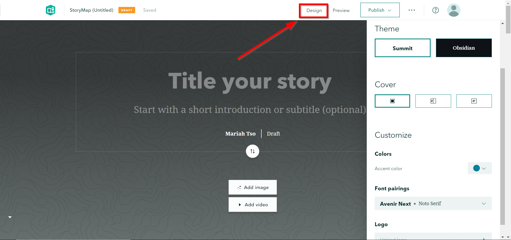
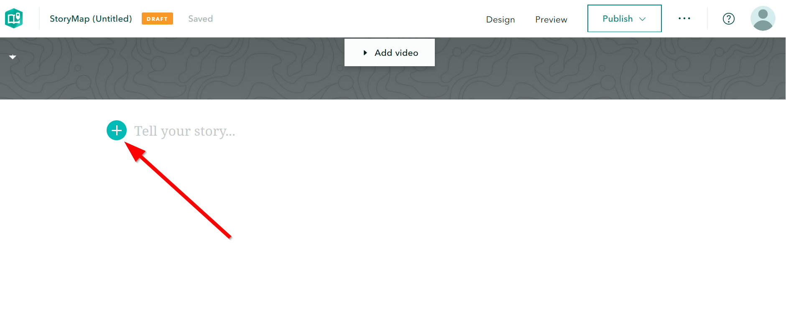
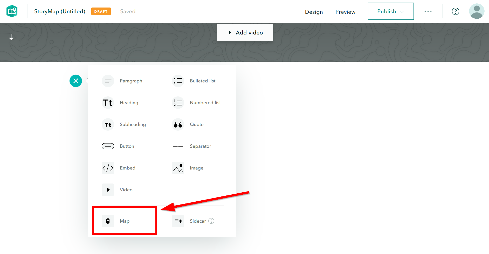
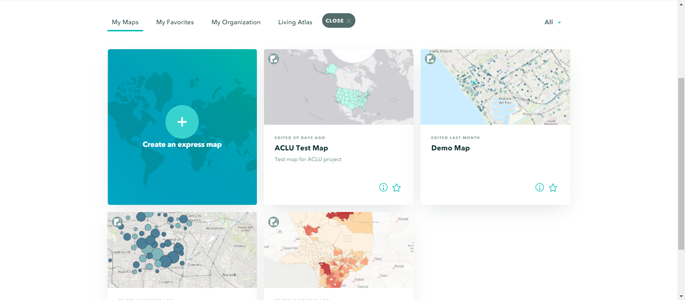
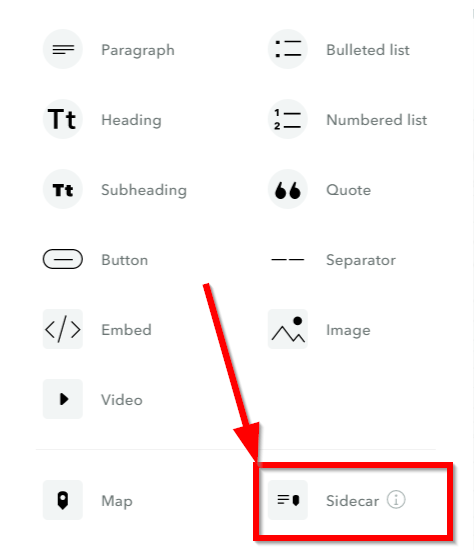
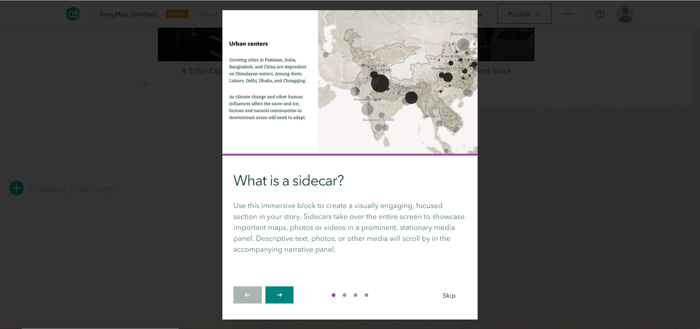
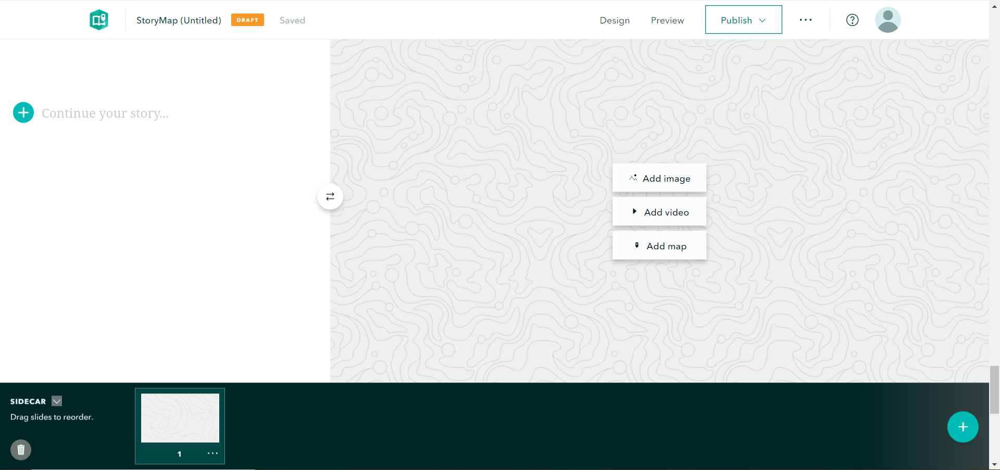
.. |sm_image7| image:: ../media/sm_image7.png
   :width: 6.5in
   :height: 3.38889in
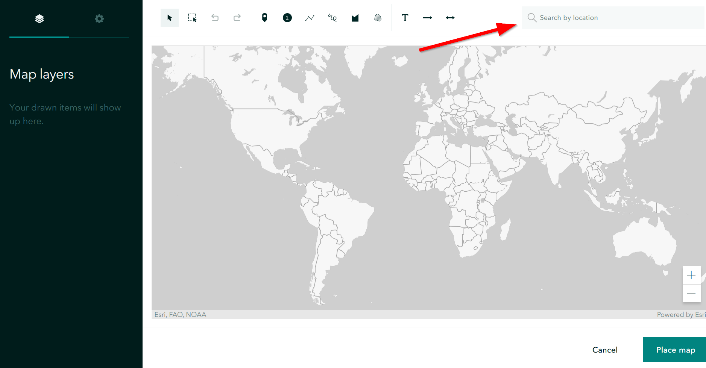
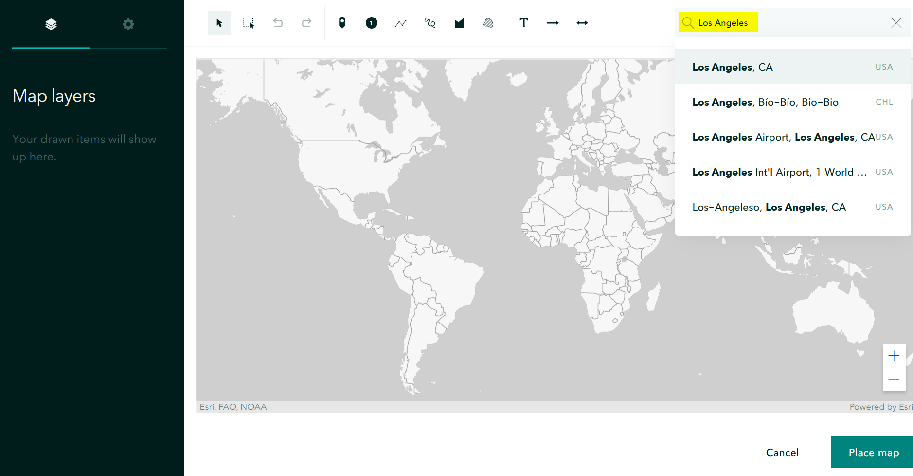
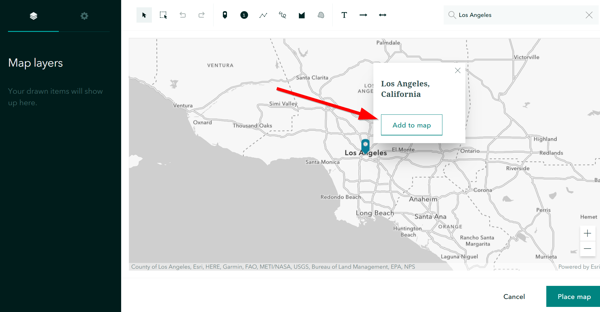
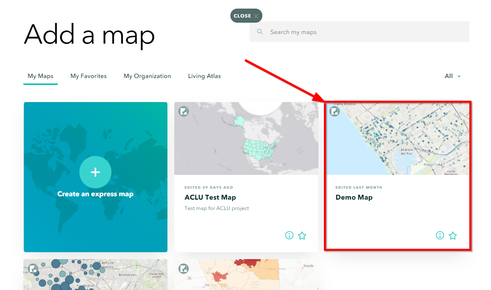
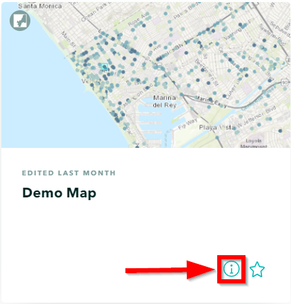
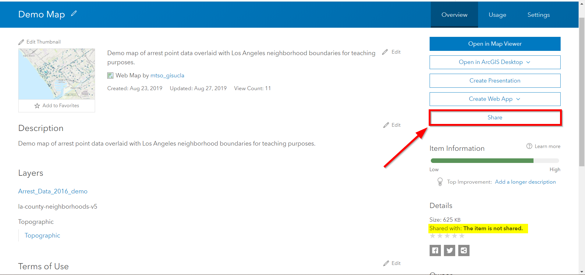
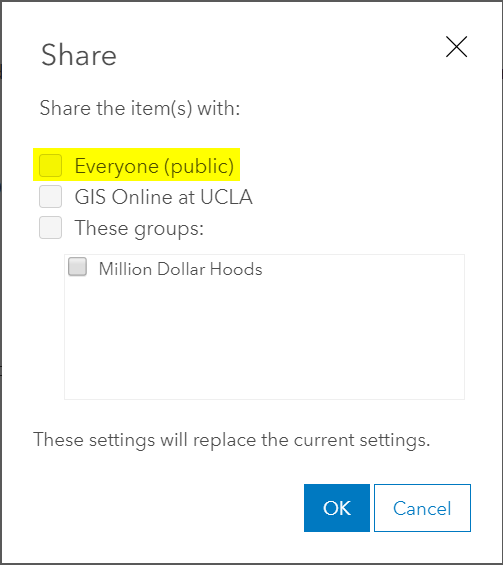
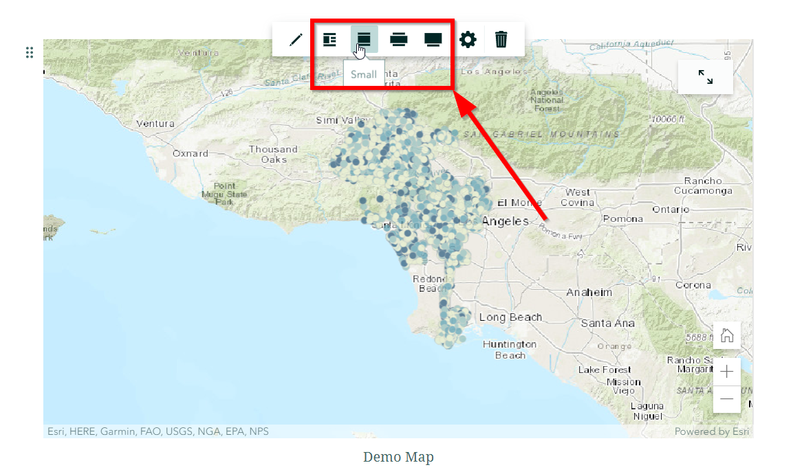
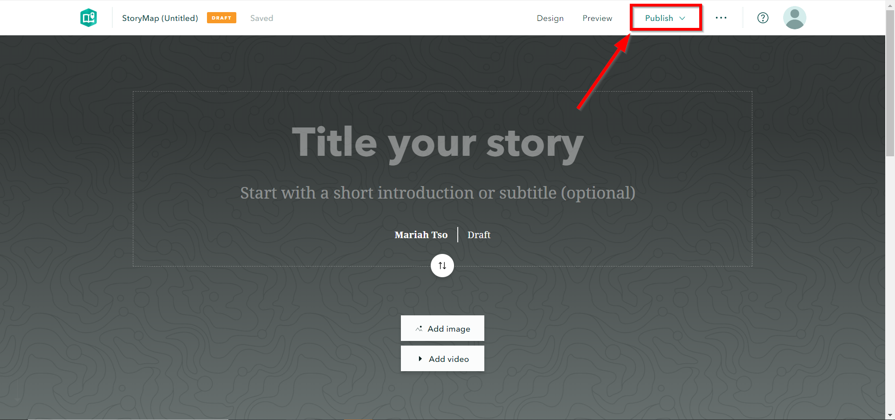
.. |sm_image17| image:: ../media/sm_image17.png
   :width: 6.5in
   :height: 4.97222in

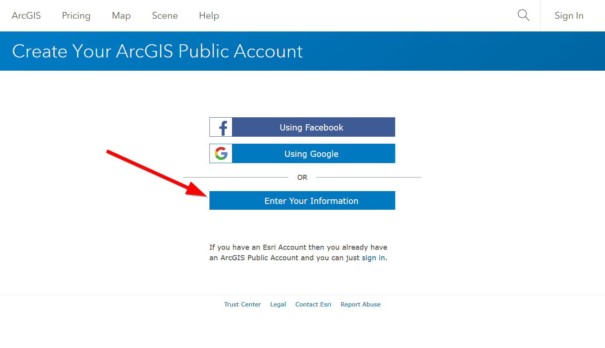
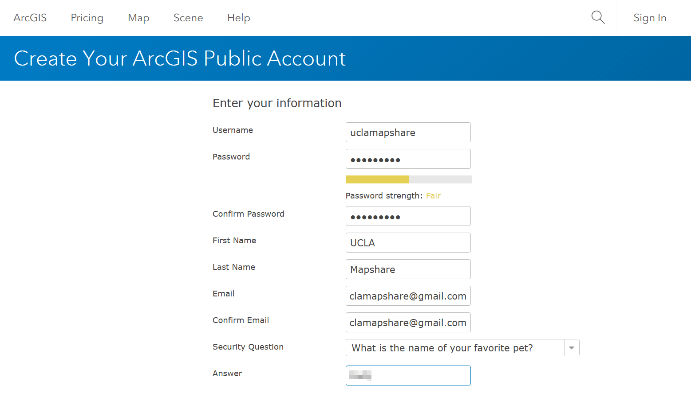
