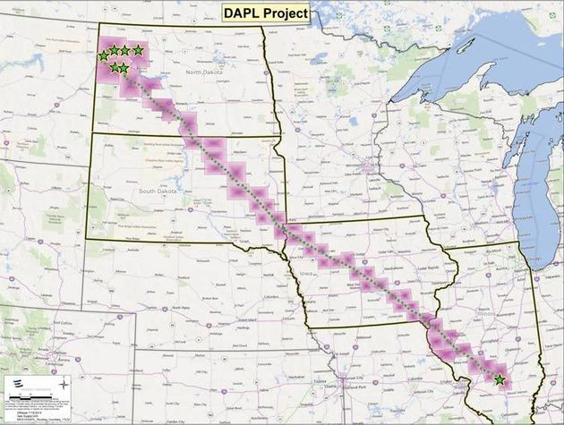
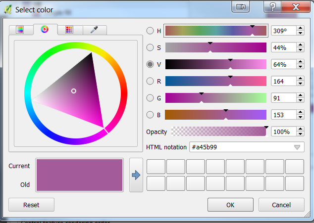
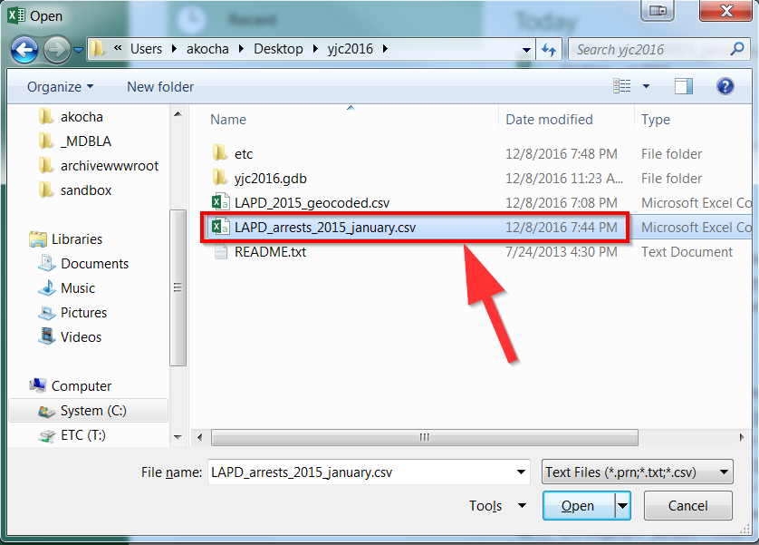
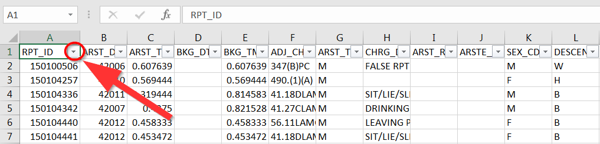

Introduction to Mapping & QGIS
==============================

Friday, December 9, 2016, 10am - 3pm

http://tinyurl.com/yjc2016ws

What is Mapping?

https://cdn.knightlab.com/libs/timeline3/latest/embed/index.html?source=1DyOxCYw5KgPCdkMwhr_zfqcE-pVT-tdjpucchc2EQrw

Our Views on Maps:
------------------

Mapping can be defined in so many different ways, there is no easy
answer to these questions. In fact, your campaigns can determine how you
design and develop parameters for your map. Below are a few examples of
just how multifaceted mapping can be for any community, and how the
digital can help scope and develop innovative approaches to research and
resistance. How then might your project utilize these tools?

Your views on maps 
------------------

Question: "What is a map? What is in a map? How do you map?" Is this a map?
'''''''''''''''''''''''''''''''''''''''''''''''''''''''''''''''''''''''''''

|rm_image0|

While mapping is increasingly being used for entertainment, there are
strong implications for mapping as a resistance tool too.

Question: "What does this map show? And what does it avoid?”
''''''''''''''''''''''''''''''''''''''''''''''''''''''''''''

|rm_image1|\ 
Source:\ `Dakota Access Pipeline Route Map by Energy Transfer
Partners <http://www.daplpipelinefacts.com/about/route.html>`__

Question: "What does this map show? Is it different from the previous map?\ ”
'''''''''''''''''''''''''''''''''''''''''''''''''''''''''''''''''''''''''''''

|rm_image2|\ 
Source: Carl
Sack\ \ http://www.huffingtonpost.com/entry/a-nodapl-map_us_581a0623e4b014443087af35

Distortions
-----------

"Everything is related to everything else, but near things are more
related than distant things." -Waldo Tobler
\ Waldo Tobler's statement defines the first law of geography, in
stating a connection between objects. This lays the foundation behind
spatial relationships.\ 

|Source: Jacques Goldstyn, 1983.|\ 
\ Source: `Jacques Goldstyn,
1983 <https://www.mapthematics.com/forums/viewtopic.php?f=8&t=233>`__\ .

Maps are a 3D projection onto a 2D surface, so what results is a SADD
distortion based on the following:

1. Shape - The way something looks in relation to another

2. Area - The total content of something in relation to another

3. Distance - How far something is in relation to another

4. Direction - Where something is in relation to another

Exercise: Think of some examples for each distortion.
'''''''''''''''''''''''''''''''''''''''''''''''''''''

To preserve one of these elements with highest accuracy, all other
elements are to be sacrificed to some degree.

|Source:
https://en.wikipedia.org/wiki/Mercator_projection#/media/File:Mercator_projection_SW.jpg|

https://en.wikipedia.org/wiki/Mercator_projection#/media/File:Mercator_projection_SW.jpg

|Impact of map projections. Source:
http://makingmapsblog.tumblr.com/post/97906950351/source-comparative-map-africa-vs-us-china|

Impact of map projections. Source:
https://www.flickr.com/photos/internetarchivebookimages/14762351614/

Question: Check out\ http://thetruesize.com/\ and try to see what is the implication of representing places as smaller than reality?
''''''''''''''''''''''''''''''''''''''''''''''''''''''''''''''''''''''''''''''''''''''''''''''''''''''''''''''''''''''''''''''''''''

Introduction to QGIS
--------------------

What is GIS?

Simply put, Geographic Information Systems (GIS) is digital mapping. In
GIS data is layered upon one another like slices on a pizza or layers of
a pie.

Download QGIS if you do not have it installed:
\ http://www.qgis.org/en/site/forusers/download.html
~~~~~~~~~~~~~~~~~~~~~~~~~~~~~~~~~~~~~~~~~~~~~~~~~~~~

Python Download (get 3.6.9 for the QGIS extended release)

https://www.python.org/downloads/

https://www.python.org/ftp/python/3.6.8/python-3.6.8-macosx10.6.pkg\ (mac)

https://www.python.org/ftp/python/3.6.8/python-3.6.8-amd64.exe\ (win)

LA Times Data Sets

http://boundaries.latimes.com

Next download the following datasets:
~~~~~~~~~~~~~~~~~~~~~~~~~~~~~~~~~~~~~

http://boundaries.latimes.com/1.0/boundary-set/la-county-neighborhoods-v5/?format=shp

\ http://sandbox.idre.ucla.edu/mapshare/data/usa/census/Los_Angeles_ZipCodes.zip

Other Data Sources
~~~~~~~~~~~~~~~~~~

Boundaries from the Los Angeles
Times:\ http://boundaries.latimes.com/sets/

Datasets hosted by UCLA:\ http://gis.ucla.edu/geodata/

Data from Los Angeles County:\ http://egis3.lacounty.gov/dataportal/

Most GIS files (also called shapefiles) will be in a zipped format, so
be sure to unzip them!

Mac Example:\ https://asmand.files.wordpress.com/2015/09/unzip-mac.gif

PC Example:\ https://www.youtube.com/watch?v=ZQOYqzGHiDY

How to add vector data
----------------------

1. Click the weird V to the left of the main menu
      \ |rm_image6|

2. Click Browse
      \ |rm_image7|

3. Find the “l.a county neighborhood (v5).shp” file and click “Open”
      \ |rm_image8|

4. Now select open
      \ |rm_image9|

5. Now the vector file should show up in the window:
      \ |rm_image10|

Working with layers:
--------------------

1. Let’s add another GIS file called Los_Angeles_ZipCodes
      \ |rm_image11|

2. Notice what happens right after you add it:
      \ |rm_image12|

3. It appears on top of the La county neighborhood (v5) layer which masks it from view.

4. If you hit the box with the X you can toggle it on and off.
      \ |rm_image13|

5. You can also drag the layer up and down.
      \ |rm_image14|

6. You can right click or cmd + click on the layer to do various things, such as open an attribute table, remove the layer, or copy it.
      \ |rm_image15|

7. Let’s click on “Open Attribute Table”:

|rm_image16|

8.  Here you can see all the data that is stored in the file:
       \ |rm_image17|

9.  You can also filter the data to show only certain things by using the expression calculator:
       \ |rm_image18|

10. For example, you can see neighborhoods with less than 10 square miles large, by using “sqmi < 10”
       \ |rm_image19|

11. Both in the table and map, the yellow rows are what is less than 10 square miles:

|rm_image20|\ 
\ |rm_image21|

12. You can clear the selection by clicking clear:
       \ |rm_image22|

13. If you want, you can go ahead and remove the layer if you’d like.

Working with styles
-------------------

1. Double click on the layer:
      \ |rm_image23|

2. Make sure you are on “Style”:
      \ |rm_image24|

3. You can change the color by clicking on color
      \ |rm_image25|

4. Feel free to change the colors in the following window by dragging the white circle
      \ |rm_image26|

5. Colors are very important for map representation, for example blue is always associated with water.
      \ |rm_image27|

6. Click “Ok” to apply your changes.

7. Your map should now be different.

Visualizing Categories (not numbers)
------------------------------------

1. Go back to the Style tab on the layer (by double clicking on it):\ |rm_image28|\ 

2. Click on the dropdown box at the top
      \ |rm_image29|

3. Select “Categorized”:
      \ |rm_image30|

4. In the new window, select the dropdown arrow near in column
      \ |rm_image31|

5. Select “Type”
      \ |rm_image32|

6. Click on “Classify”
      \ |rm_image33|

7. The following should show up:
      \ |rm_image34|\ 

8. You can edit the colors if you’d like by clicking on them, otherwise
      click “Ok”:
      \ |rm_image35|\ 

9. You map should now be categorized:
      \ |rm_image36|\ 

Visualizing numbers (not categories)
------------------------------------

1.  Re-add the Los_Angeles_ZipCode layer.

2.  Go to layer properties of the Los_Angeles_ZipCode layer and then “Style”.

3.  Select “Graduated”
       \ |rm_image37|

4.  Go ahead and select the drop down near Column again:
       \ |rm_image38|

5.  Select shape_area:
       \ |rm_image39|

6.  Click “Classify”
       \ |rm_image40|

7.  You can change the “Mode” to select different ways of breaking down the numbers area of the zipcodes:
       \ |rm_image41|

8.  As you can tell, this type of data visualization can be useful when working with population, number of arrests, etc.

9.  When you are done selecting and noticing how the numbers change, feel free to hit “Ok”

10. You map should look like the following:

|rm_image42|

Taking data out of QGIS
-----------------------

Sometimes you want to take data out of QGIS to manipulate it in other
software, such as Excel. You can do so, by opening the layer properties
and clicking save as:

|rm_image43|

You can now choose a file type and name, make sure to select “CSV”:

|rm_image44|

.. _section-1:

.. _section-2:

Data Management with Excel
--------------------------

Lets go ahead and open another CSV file, you are welcome to open the
neighborhoods.csv file too though.

How to open CSV files

1. Go to File -> Open

2. Select “Text” file
      \ |rm_image45|

3. Select the “LAPD_arrests_2015_january.csv” file:
      \ |rm_image46|

4. Excel always provides a summary of selected information near the
      bottom:
      \ |rm_image47|\ 

Before going forward, lets make sure our data columns are in good order:

ARST_DATE should be a date field, and ARST_TM should be a Time Field.

1. Select the columns:

|rm_image48|

2. Select dropdown box near the top:
\ |rm_image49|

3. Then choose “Short Date”:

|rm_image50|

4. For ARST_TM choose “Time”:

|rm_image51|

5.Do the same for BKG_DT and BKG_TM as well.

Formulas
--------

Excel is a spreadsheet program, which means it is made up of rows and
columns: one giant table. One of the most powerful tools is formulas,
which means starting a cell with an “=”

Go ahead and find an empty cell so we can start our formula:

|rm_image52|

S2 looks like a good spot.

The most basic formula we will use is to combine columns together:

=\ A1 & B1

Every Excel formula relies on using the cells of a table in order to
work. For example A1 is the very first cell in the spreadsheet. If you
want to combine the contents in the first cell together with the second
column, then you can use “=\ A1\ &\ B1\ ”

Question: Whats the formula to combine the Lat(\ Q2) and Long(\ R2) columns into one?
                                                                                     

If you simply add the two, it might look a little messy, so we should add a space in between columns by the following formula:
~~~~~~~~~~~~~~~~~~~~~~~~~~~~~~~~~~~~~~~~~~~~~~~~~~~~~~~~~~~~~~~~~~~~~~~~~~~~~~~~~~~~~~~~~~~~~~~~~~~~~~~~~~~~~~~~~~~~~~~~~~~~~~

=\ A1\ &“ “&\ B1

You will notice that the “ “symbols acts as a seperator. You can go
ahead and put anything in between those symbols and it will appear in
between the result.

Question: Whats the formula to combine the Lat(\ Q2) and Long(\ R2) columns into one with a comma in between?
                                                                                                             

Sorting
-------

In the top part of the menu you can select “Sort”:

|rm_image53|

A dropdown arrow will now be shown next to the first row (also known as
the header)

|rm_image54|

When clicking it, you can choose to sort the information in different ways:

|rm_image55|

We will sort the data from highest to lowest arrest date:

|rm_image56|

Feel free to explore sorting the data!

Filtering
---------

You can also filter the data by using the Checkboxes or the Filter By
box below the Sort options:

|rm_image57|

Different data types will have different filter options, feel free to
try it out and answer this question:

Question: How many arrests were there on January 1st?
'''''''''''''''''''''''''''''''''''''''''''''''''''''

Back to QGIS for a moment!
--------------------------

Sometimes you want to summarize data up, for example you want to see the
number of arrests by zipcodes or neighborhoods. To do this, you need to
do what is called a spatial join.

Add a CSV file in QGIS 
-----------------------

Start by clicking the comma:
\ |rm_image58|

After finding the file, a new dialogue box will show up. Be sure to have
Lat and Long selected for the X and Y values [X is always Longitude and
Y is always Latitude]:

|rm_image59|

Spatial Joining Data
--------------------

1.  Make sure you have the two layers you want to join together, in this 
case the LAPD_arrests_2015_january.csv and the Los_Angeles_ZipCodes.

2.  Go to Vector in the menu
       \ |rm_image60|

3.  Then Data Management
       \ |rm_image61|

4.  Then Join Attributes by Location
       \ |rm_image62|

5.  The target layer should be the layer you want the data to go
 towards, the join layer is the layer you are taking the
 information from. So in this case, the Target is the Los Angeles
 ZipCodes, while the Join is the LAPD_arrests_2015_january.

6.  Make sure to choose “Intersects” for the Gemetric Predicate.

7.  Be sure to select “Take a summary of Intersecting Features” and you
 only need “sum” and “mean” for the Statistics field.

8.  Your text box should look like the following:
       \ |rm_image63|

9.  Click “Run” to run the join.

10. A new layer called “Joined Layer” should show up:
       \ |rm_image64|

11. Go ahead and open the attribute table and see if the “sum” worked!

12. Try and visualize the data like so:

|rm_image65|

Exporting a map
---------------

QGIS has a tool called “Print Composer” to take care of all your map
printing needs. You can find it by going to “File” then “New Print
Composer”

|rm_image66|

After opening a new print composer, you should add a map, which can by
done by going to “Layout” then “Add new map”:

|rm_image67|

Draw a box to add your map:
\ |rm_image68|

|rm_image69|

You can also add text, shapes and other content.

When you are done using QGIS, you can save your project as a QGIS file:

|rm_image70|

Extra Topics!
-------------

Georeferencing
--------------

http://www.findlatitudeandlongitude.com/batch-geocode/\ (down)

Pivot Tables
------------

http://www.excel-easy.com/data-analysis/pivot-tables.html

Mapping Projects to Explore
---------------------------

http://dsl.richmond.edu/panorama/

.. |Source: https://en.wikipedia.org/wiki/Mercator_projection#/media/File:Mercator_projection_SW.jpg| image:: ../media/4m_image4.jpg
   :width: 6.45833in
   :height: 5.48611in
.. |Impact of map projections. Source: http://makingmapsblog.tumblr.com/post/97906950351/source-comparative-map-africa-vs-us-china| image:: ../media/4m_image5.jpg
   :width: 6.29167in
   :height: 6.625in
.. |rm_image6| image:: ../media/rm_image6.png
   :width: 6.5in
   :height: 3.04167in
.. |rm_image7| image:: ../media/rm_image7.png
   :width: 3.76563in
   :height: 2.04213in
.. |rm_image8| image:: ../media/rm_image8.png
   :width: 6.5in
   :height: 4.13889in

.. |rm_image11| image:: ../media/rm_image11.png
   :width: 6.5in
   :height: 4.08333in

.. |rm_image13| image:: ../media/rm_image13.png
   :width: 6.5in
   :height: 3.91667in

.. |rm_image15| image:: ../media/rm_image15.png
   :width: 6.5in
   :height: 3.91667in
.. |rm_image16| image:: ../media/rm_image16.png
   :width: 5.08854in
   :height: 3.65331in
.. |rm_image17| image:: ../media/rm_image17.png
   :width: 6.5in
   :height: 3.88889in

.. |rm_image19| image:: ../media/rm_image19.png
   :width: 3.47203in
   :height: 2.82813in

.. |rm_image24| image:: ../media/rm_image24.png
   :width: 6.5in
   :height: 4.19444in

.. |rm_image43| image:: ../media/rm_image43.png
   :width: 6.5in
   :height: 4.66667in

.. |rm_image53| image:: ../media/rm_image69.png
   :width: 7.01923in
   :height: 1.90104in

.. |rm_image58| image:: ../media/rm_image57.png
   :width: 3.89063in
   :height: 3.99845in
.. |rm_image59| image:: ../media/rm_image58.png
   :width: 5.14497in
   :height: 3.34896in
.. |rm_image60| image:: ../media/rm_image59.png
   :width: 5.07813in
   :height: 4.06087in

.. |rm_image62| image:: ../media/rm_image61.png
   :width: 3.49479in
   :height: 3.22364in

.. |rm_image64| image:: ../media/rm_image63.png
   :width: 6.5in
   :height: 3.68056in

.. |rm_image69| image:: ../media/rm_image68.png
   :width: 6.5in
   :height: 3.98611in
.. |rm_image70| image:: ../media/rm_image70.png
   :width: 5.375in
   :height: 4.01042in
